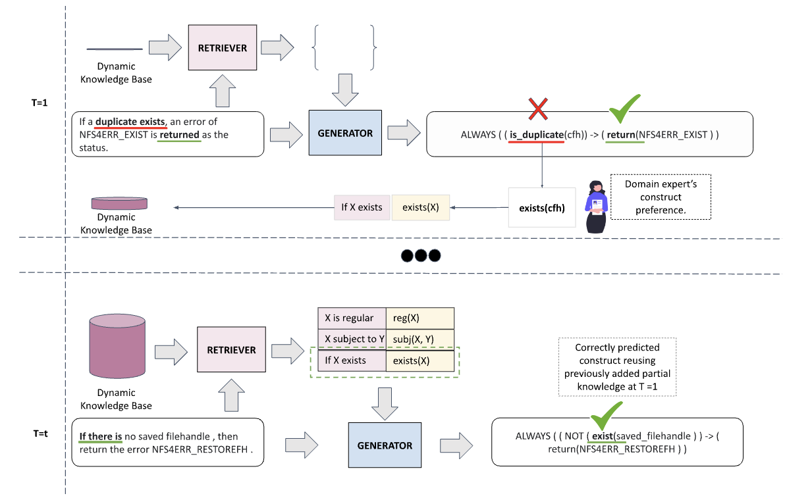

# <h2 align="center"> Handling Open-Vocabulary Constructs in Formalizing Specifications: Retrieval-Augmented Parsing with Expert Knowledge </h2>

This is the repository for our COLM 2024 paper "Handling Open-Vocabulary Constructs in Formalizing Specifications: Retrieval-Augmented Parsing with Expert Knowledge".

Paper link: [https://openreview.net/forum?id=BgvgMxY8s5#discussion](https://openreview.net/forum?id=BgvgMxY8s5#discussion)

## Abstract
We address the challenge of *Open-Vocabulary Constructs* (OVCs) in converting natural language (NL) specifications into formal languages, where models struggle due to unknown constructs. Domain experts can provide correct constructs at inference time, and our goal is to reuse this expert knowledge without retraining. We introduce dynamic knowledge-augmented parsing (**DKAP**), where a model uses a growing expert-provided lexicon linking NL phrases to OVCs. We propose **ROLex**, a retrieval-augmented parser that leverages this lexicon. Using synthetic data and augmentation techniques, we train the parser and focus on relevant retrieved knowledge. Evaluations across three formalization tasks show that DKAP is challenging, but ROLex improves performance by utilizing dynamic expert knowledge.

## Example
The following figure is an example of how ROLex works in DKAP setting for parsing OVCs in a specification, coming from the Network File Systems domain, that needs to converted to Linear Temporal Logic.




## Code
Our codebase is divided into three segments for each of the benchmarks: NL2LTL, NL2Code & NL2CMD. Each folder contains an invidual Commands.md file that gives details on how to run the commands for generating the dataset and running the models.

## Datasets
All the datasets used for simulations can be generated using code in each folder. The human annotated dataset for the NFS RFC is provided in the repository itself due to its small size.

## Models
We have released the following set of models for the NL2LTL Task on Huggingface hub:
- Retriever Model [Link](https://huggingface.co/StonyBrookNLP/nfs_rfc_retriever)
- Base Generator Model [Link](https://huggingface.co/StonyBrookNLP/nfs_rfc_baseline_generator)
- ROLex Generator Model (trained via Transfer Learning scheme elaborated in the paper) [LINK](https://huggingface.co/StonyBrookNLP/nfs_rfc_rolex_generator)

Further models can be availed upon request

## Contact

For further enquiries about the project, please email Md.Saqib Hasan at mdshasan@cs.stonybrook.edu.

## Citation 

```
@inproceedings{hasan2024handling,
  title={Handling Open-Vocabulary Constructs in Formalizing Specifications: Retrieval Augmented Parsing with Expert Knowledge},
  author={Hasan, Mohammad Saqib and Ghosh, Sayontan and Verma, Dhruv and Kuenning, Geoff and Zadok, Erez and Smolka, Scott and Balasubramanian, Niranjan},
  booktitle={First Conference on Language Modeling}
}
```
